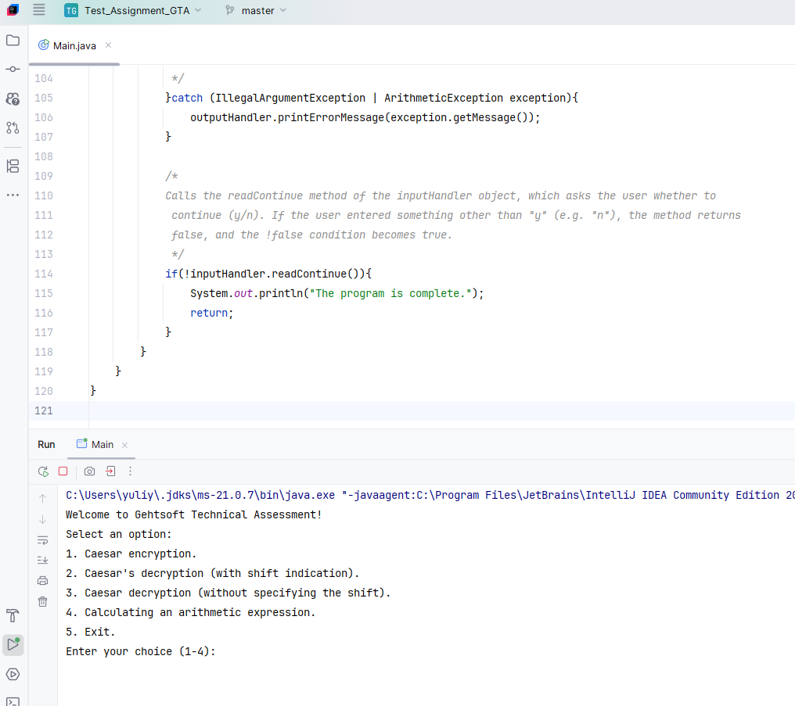
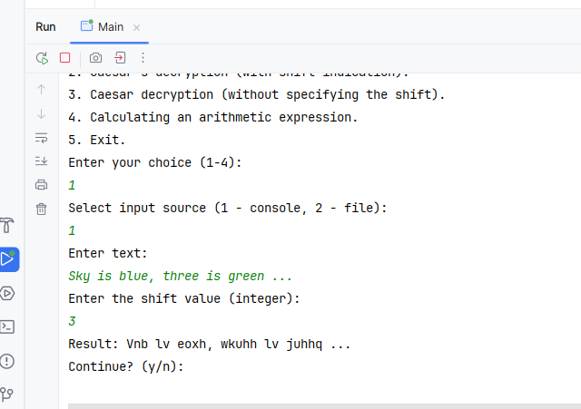
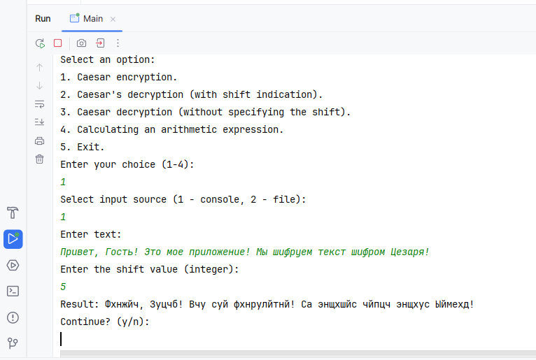
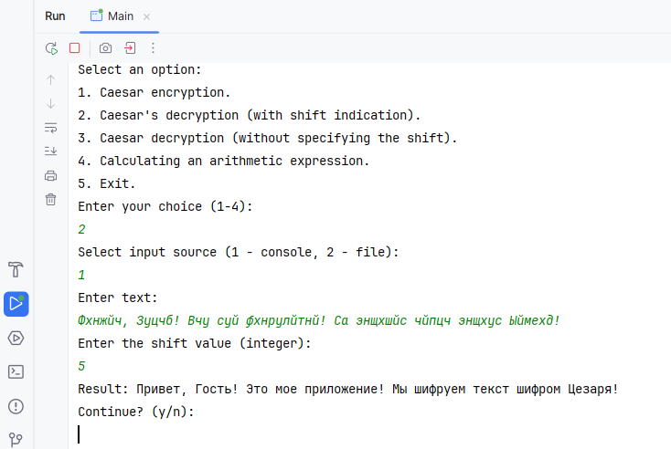
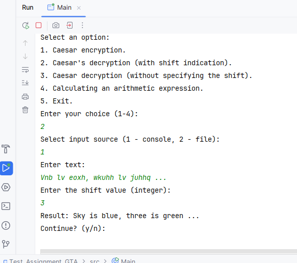
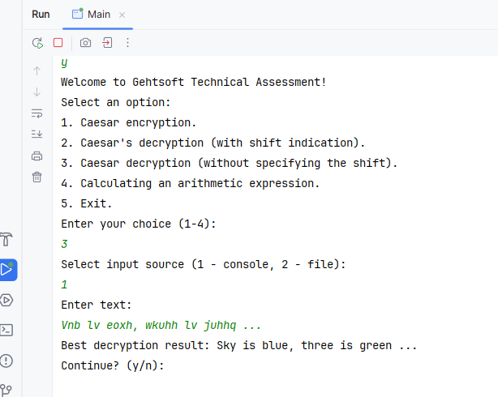
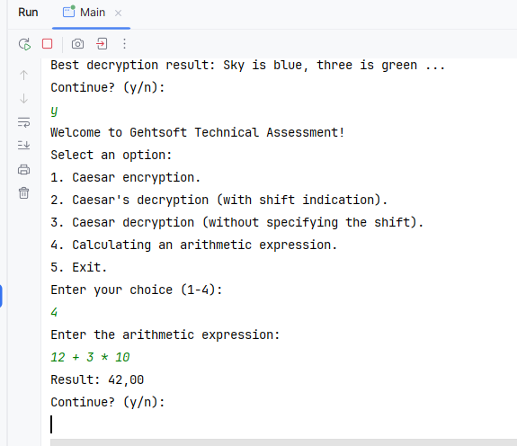

# TEST ASSIGNMENT (GTA)

## Table of contents
1. [Description](#description)
2. [Technical requirements](#technical_requirements)
3. [Installation and Launch](#installation-and-launch)
4. [Approach and Assumptions](#approach_and_assumptions)
5. [Implementation](#implementation)
6. [Executor](#executor)
7. [Usage Examples](#usage-examples)
8. [Screenshots](#screenshots)

## Description

A Java console application implementing the Caesar cipher and arithmetic 
expression calculator. 
Supports:

- Text encryption and decryption (Russian and English alphabets) taking 
into account case and non-alphabetic characters.
- Calculation of arithmetic expressions with support for operations '+', '-', '*', '/'. 
brackets, decimal and negative numbers.
- Console and file input, error handling, and modular architecture.

To optimize the solution of the task, fundamental algorithms (Caesar cipher, Shunting Yard, 
Frequency analysis, Chi-square) were implemented in the application.

## Technical requirements

- Programming language: **Java 21**
- Application type: **Console application**
- Architecture: **Clean, modular code with separate classes for each 
functionality**
- Error Handling: **Correct exception handling for invalid input**
- UI: **Simple console menu to choose between operations**

## Installation and Launch

1. Clone the repository:
   ```bash
   git clone https://github.com/YuliyaZimenina/Test_Assignment_GTA.git
   cd  Test_Assignment_GTA
   ```
2. Open the project in your favorite IDE (IntelliJ IDEA, Eclipse, etc.)
3. Run the application (class: Main.java).
4. **NOTE:** To read from a file, create a file input.txt in the root 
directory of the project with text in UTF-8 encoding. 

## Approach and assumptions

1. **Caesar Cipher:** implemented using two alphabets (Russian and English). Supports hyphenation, case preservation and
processing of non-alphabetic characters. Decryption without shift shows the most suitable decryption result of the 
incoming text. Frequency analysis and chi-square are used to select the best decryption result of the incoming text.
2. **Expression Evaluator:** Uses the sorting yard algorithm to convert expressions to RPN and a stack for calculation. 
Supports PEMDAS, brackets, decimals, and negatives.
3. **Modularity:** The code is divided into classes for encryption, analysis, calculations, and input/output.
4. **Error Handling:** Crashes invalid input, division by zero, file problems, and bracket mismatches.

## Implementation

1. **Caesar Cipher:**
- Supports Russian and English alphabets (Alphabet.java).
- Preserves the case of letters.
- Non-alphabetic characters remain unchanged.
- Processes cyclic shift and positive/negative shifts.
- Supports console and file input (InputHandler.java).
- Implemented decryption with and without specifying a shift.

2. **Arithmetic expression evaluator:**
- Parses and evaluates expressions taking into account PEMDAS/BODMAS (ExpressionParser.java, ExpressionEvaluator.java).
- Supports nested parentheses.
- Processes decimal and negative numbers.
- Properly handles division by zero.


## Executor

[Yuliya Zimenina](https://github.com/YuliyaZimenina)

## Usage Examples

- **Ceaser Cipher**
**Input** ```Hello Java!```, сдвиг: ```3``` -> **Output:** ```Khoor Mdyd!```
**Input** ```Привет, Джава!!```, сдвиг: ```6``` -> **Output:** ```Хцозкш, Ймёзё!```

- **Decoding the Caesar Cipher**
  **Input** ```Khoor Mdyd!```, сдвиг: ```3``` -> **Output:** ```Hello, Java!```

- **Calculating an arithmetic expression**
**Input** ```7 + 9 * 2``` -> ***Output***```25.00```
**Input** ```(4 + 10) / 2``` -> ***Output***```7.00```
**Input** ```-23 + 13``` -> ***Output***```-10.00```


## Screenshots

1. The application launch:

 

2. Ceaser cipher (English alphabet):

   

3. Ceaser cipher (Russian alphabet):

 

4. Decryption (Russian alphabet):



5. Decryption (English alphabet):



6. Decrypt without shift:



7. Arithmetic expression:




